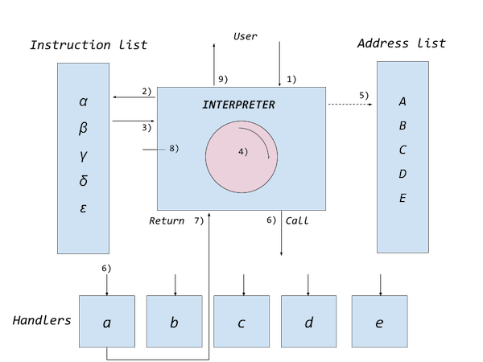

# Virtual Machines

Virtual machines samples[^1]. A collection of virtual machines to teach or understand some
ideas and inner workings of virtual machines. They are solely intended for show of principles,
and not for uses in any other way.

[^1]: My best inspiration for the code of simple machines *here* comes from Bartosz Sypytowski:
https://bartoszsypytkowski.com/simple-virtual-machine/ from whom I derived basically the main
code, even though some bugs were corrected and many more additions has been made.

My interest in virtual machines started long time ago, first with *USCD Pascal* on the *Apple II*
sometime around 1980 or 1981 ...

__NOTE: The term "virtual machine" can often be replaced by "emulator", "interpreter" etc. and
perhaps should not be restricted or qualified too much. The idea of an abstraction that separates
the underlying mechanics from the levels above is what should be observed, not a deepend confusion
of concepts which already are ambiguous and not very well definied anyway.__

The term "virtual machine" and also "interpreter" has been used for such diverse fields as from the
Apollo Guidance Computer[^2], code from Busicom interpreted[^3] to run on Intel 4004,
and Steve Wozniack routines in SWEET16[^4].

[^2]: This does not verify the reference, but gives general info on AGC,
https://en.wikipedia.org/wiki/Apollo_Guidance_Computer 
[^3]: Neither this verify reference to VM, but general info on Intel 4004,
https://en.wikipedia.org/wiki/Intel_4004
[^4]: SWEET16, https://en.wikipedia.org/wiki/SWEET16 but also in Byte no 11, 1977:
https://archive.org/details/BYTE_Vol_02-11_1977-11_Sweet_16/page/n151/mode/2up

### Interpreter technique

Close to "virtual machines" there is in principal a "interpreter technique".
The main point of the technique can be described as:[^5]

[^5]: I main translated excerpt from the Swedish journal *Modern elektronik*, 1981.
Ideas and facts: Hans Beckman, Johan Finnved, ed. Gunnar Christernin.

1. the interpreter is called, with a list of instructions as argument
2. the interpreter takes an instruction from the incoming list,
3. do a look up in the internal list of instructions (types),
4. then the interpreter ”interprets” the instruction of what to do,
5. which points to an address list, and thus a corresponding handler for each (type of) instruction,
6. the handler is called, do something,
7. after handling, the call returns from the handler, and
8. the interpreter goes on to the next instruction, start over from 1 to 8 as long as there are instructions left
9. when all the instructions have been consumed, the interpreter returns to the main caller

## *From virtual machines to compilers*

### 1. [vm1](/vm1)

We start off with a simple virtual stack machine. To not be confused too much, it has been simplified
in many ways. There is no error checking, no warnings, you have to compile the machine if you only
slightly change the program, etc. The idea is to grasp what happends inside the virtual machine
and use code as the main instructive part.

### 2. [vm2](/vm2)

Next, the machine has been expanded with unconditional and conditional jumps, some
storage facilities, but also adding some concepts deriving from FORTH, such as e.g. DROP,
DUP, or SWAP. The algorithm of Fibonacci is used archetypically with different
implementations, where the concepts used from FORTH can be seen. FORTH is also a
language which can use a virtual machine and, as in C, it is often close to the real machine
on which it runs (often denoted by "low level languages").

### 3. [vm3](/vm3)

This time we slim the machine down, get rid of the many extra powerful concepts from FORTH.
Instead we insert some "standard" concepts of call and return through the use of "activation records".

### 4. [chip8](/chip8)

We have alook at an early virtual machine used for games starting in the late 70'ties: CHIP-8. 

### 5. [cmp1](/cmp1)

### 6. [cmp2](/cmp2)

### 7. [cmp3](/cmp3)

