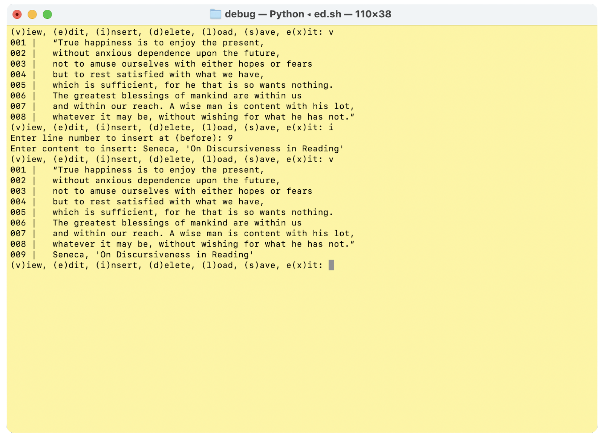
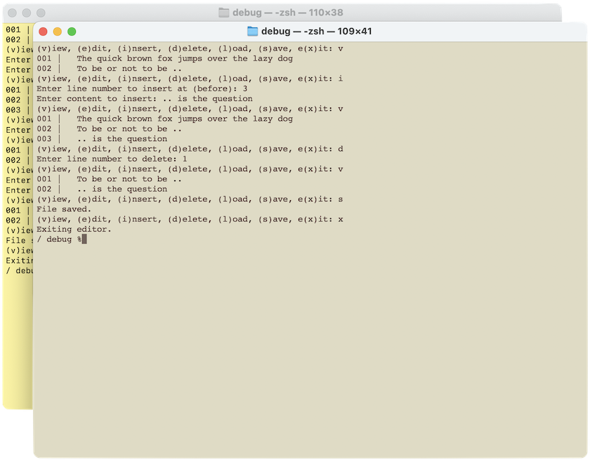
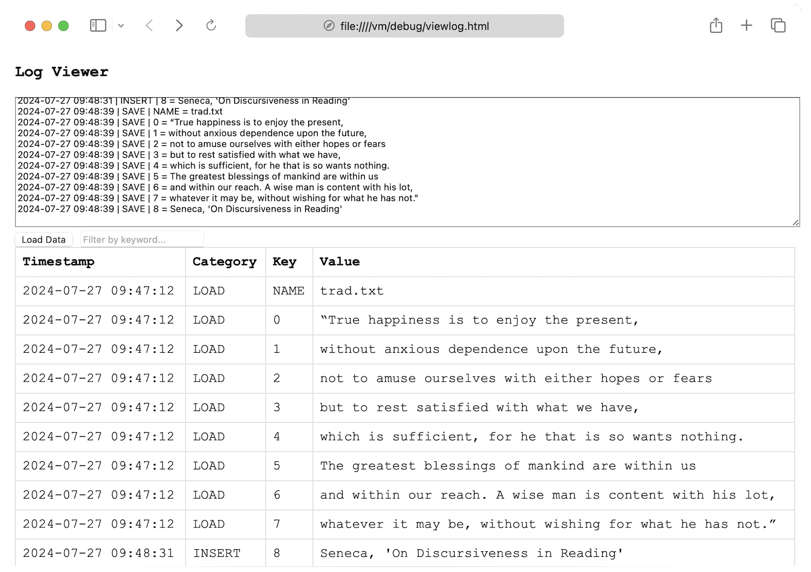
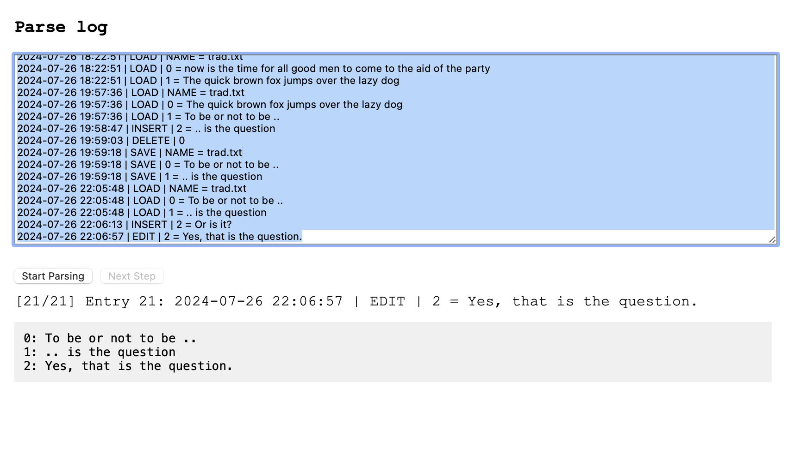
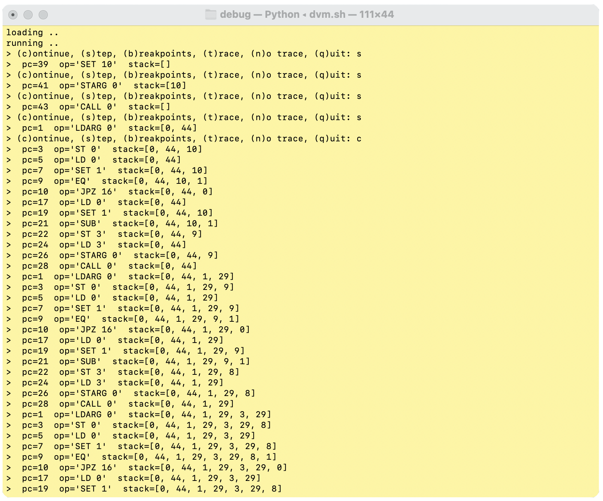
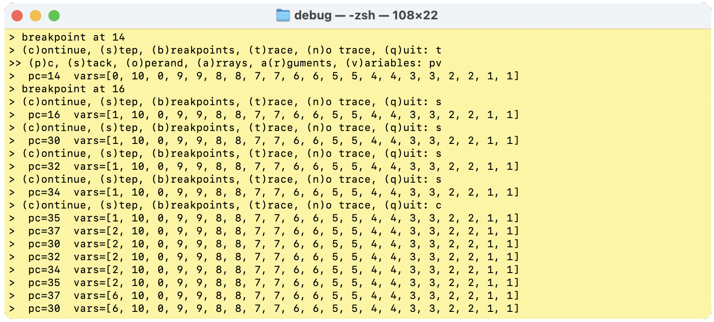

# Virtual Machines

Debugging has been an integral part of computing since
the early days of programming. In many ways, programming
remains a *craft*, and debugging is a critical aspect of
that craft.

Early debugging tools were fundamental yet highly effective.
Techniques such as logging, single-stepping through code,
and setting breakpoints to halt execution for detailed
inspection were very useful. These methods allowed developers
to meticulously trace and resolve issues.

In this exploration, we’ll revisit these simple but powerful
debugging tools and see how they are still relevant when
working with virtual machines, or really in any programming
environment.

But, we will return to these tools examplified below.


## logging

*This section is intended to highlight that the principles of
application and system development should not be compartmentalized.
Tools like loggers, commonly used in systems, can also be highly
beneficial in other applications. For example, integrating a logger
into an editor can be very useful.*

As previously stated, logging is a tool with many aspects and uses.
Here, we demonstrate this by using a *line editor*. A line editor was
once very common in the past. It was easy to implement and versatile,
making it effective for editing text files. As long as the files
weren’t too large, it wasn’t too difficult to use. We will not delve
into the specifics of line editors, as that is not our aim here.
Instead, we want to illustrate how logging can benefit even editors.
In this case, you can have the *entire history of edits* saved. From
the saved file, you can, in principle, work backwards in steps, undo
or redo edits. The log would contain enough information to restore
the session and continue from where you left off, even if you just
quit the editor. Todays computer may be fast enough to not corrupt
saving the log, so in principal it should work ok. That is just
one idea that could be implemented even in editors of today.

### run

```shell
> python3 ed.py -i trad.txt
```



### line editor

We start off with a very simple line editor 'ed.py'. It can load text
files, view them, insert a line, delete a line, edit a line, save the
file. The bare necessities.

In short `load_file` loads the content of the file into `self.lines`,
while `save_file` saves the current lines to the current file. The
`view` displays the content of the file with line numbers. The
functions take a more closer approach `edit` replaces a specific line
with new content, `insert` inserts new content at a specific line, and
`delete` deletes a specific line. Next `run` is the main loop to handle
user commands "view, edit, insert, delete, load, save, exit".

### run

```shell
> python3 ed2.py -i trad.txt
```



### line editor with logger

The second editor 'ed2.py' includes a built-in *logger*, which distinguishes it
from 'ed.py'. Despite this improvement, the functionality remains largely
similar to the previous version. There are always room for improvement,
but cut off with regards to pegagogical values.[^flawed] The 'log.txt'
is hardcoded for every text that runs through the editor. Logs are usually
custom-built and may vary in format.

[^flawed]: The logs are significantly flawed and redundant. The log file
can grow immensely in proportion to the files they track. For example,
a saved file is fully represented in the log file both when it is
loaded and saved.

### view log

```shell
> cat log.txt
```

```log
2024-07-27 09:47:12 | LOAD | NAME = trad.txt
2024-07-27 09:47:12 | LOAD | 0 = “True happiness is to enjoy the present,
2024-07-27 09:47:12 | LOAD | 1 = without anxious dependence upon the future,
2024-07-27 09:47:12 | LOAD | 2 = not to amuse ourselves with either hopes or fears
2024-07-27 09:47:12 | LOAD | 3 = but to rest satisfied with what we have,
2024-07-27 09:47:12 | LOAD | 4 = which is sufficient, for he that is so wants nothing.
2024-07-27 09:47:12 | LOAD | 5 = The greatest blessings of mankind are within us
2024-07-27 09:47:12 | LOAD | 6 = and within our reach. A wise man is content with his lot,
2024-07-27 09:47:12 | LOAD | 7 = whatever it may be, without wishing for what he has not.”
2024-07-27 09:48:31 | INSERT | 8 = Seneca, 'On Discursiveness in Reading'
2024-07-27 09:48:39 | SAVE | NAME = trad.txt
2024-07-27 09:48:39 | SAVE | 0 = “True happiness is to enjoy the present,
2024-07-27 09:48:39 | SAVE | 1 = without anxious dependence upon the future,
2024-07-27 09:48:39 | SAVE | 2 = not to amuse ourselves with either hopes or fears
2024-07-27 09:48:39 | SAVE | 3 = but to rest satisfied with what we have,
2024-07-27 09:48:39 | SAVE | 4 = which is sufficient, for he that is so wants nothing.
2024-07-27 09:48:39 | SAVE | 5 = The greatest blessings of mankind are within us
2024-07-27 09:48:39 | SAVE | 6 = and within our reach. A wise man is content with his lot,
2024-07-27 09:48:39 | SAVE | 7 = whatever it may be, without wishing for what he has not.”
2024-07-27 09:48:39 | SAVE | 8 = Seneca, 'On Discursiveness in Reading'
```


### A log viewer

Long logs can be challenging to navigate. A dedicated viewer `viewlog.html`
with filtering or sorting options can make this process easier. While text
files may not present many obstacles, programming languages or machine code
often benefit significantly from such specialized tools.




### A playback viewer

In this case with a line editor that have a *recording log*, a *playback
viewer* `playlog.html` will illustrate how a textfile gets created. As can
be understood from this, versioning, alternate copies, and other reconizable
properties from e.g. versioning software could in principle also be added.



Thus logging is often a system tool, but it capture ideas that can be use
in many other ways.


## Assembling & disassembling

Taking an assembler from previous, we can turn it into something which
analyses our "machine code," a disassembler. It reverses the process,
takes the integers and turn them into easier to understandable mnemonics,
the "assembly language."


### Disassembler

If we take the following 'binary' in 'sample.b':

```code
38,13,0,28,0,12,0,27,1,5,11,16,27,1,30,
0,24,12,0,27,1,31,28,3,12,3,29,0,2,0,12,
0,14,0,18,30,0,24,24,27,10,29,0,2,0,14,
0,22,8
```

we can convert it into what it previously was
assembled from:

```shell
> python3 disasm.py -i sample.b -o sample.d
> cat sample.d
L0:
	LDARG 0     # 013 000
	ST 0        # 028 000
	LD 0        # 012 000
	SET 1       # 027 001
	EQ          # 005
	JPZ :L16    # 011 016
	SET 1       # 027 001
	STORE 0     # 030 000
	RET         # 024
L16:
	LD 0        # 012 000
	SET 1       # 027 001
	SUB         # 031
	ST 3        # 028 003
	LD 3        # 012 003
	STARG 0     # 029 000
	CALL :L0    # 002 000
	LD 0        # 012 000
	LOAD 0      # 014 000
	MUL         # 018
	STORE 0     # 030 000
	RET         # 024
	RET         # 024
START:
	SET 10      # 027 010
	STARG 0     # 029 000
	CALL :L0    # 002 000
	LOAD 0      # 014 000
	PRINT       # 022
	HALT        # 008
```

Disassemblers can be useful, when e.g. the source isn't available
or when you want to inspect the machine and the program in this
context.


## debug vm

### tracing

Tracing involves inserting print statements or logging calls
into the code to output the program’s state and the values of
variables or in this case mostly the stack at various points
during execution. This helps to follow the program’s flow and
understand where things might be going wrong.

### single step

Single-stepping allows the programmer to execute the program
one line or instruction at a time. This lets you closely examine
the program’s behavior at each step and observe how the stack
(or in case: variables) and the system state change with each
executed line of code.

### breakpoints

Breakpoints are markers set in the code where the execution
will pause, allowing the developer to inspect the program state
at specific points. This is useful for examining the conditions
leading up to a particular point in the code, especially where
issues are suspected to occur.


### simple debugging workflow

1. __setting breakpoints__: set breakpoints at critical sections or
   where one suspect a bug might be,
2. __run to breakpoint__: the program runs normally until it hits a
   breakpoint,
3. __inspect__: once paused, inspect stack, variables, other memory,
   to understand the program’s condition at that moment,
4. __single step__: after inspection, single-step through subsequent
   lines to observe changes and further diagnose issues.
   or just let the program *continue*,
5. __trace__: supplementary to breakpoints and stepping, trace logs
   provide a broader picture of program flow, stack and variable 
   states throughout the execution.

### dvm

A simple implementation of some debugging tools inside a previously
seen vm, let you choose for 'singlestep', setting 'breakpoints' and an
optional 'trace'.

```shell
> python3 dvm.py --singlestep true --breakpoints 14,16 --trace true --input sample.b
```



Inside the vm, there are features that allow you to single-step
through the code if selected at the start. When single-stepping
is no longer needed, the ‘continue’ command can execute the code
without pausing at each step.

A trace can display various elements, such as the current stack,
the program counter, the executing operator and operand, and
other options like arrays, arguments, and variables. The trace
can be turned off, and the options can be selected dynamically.
For example, choosing ‘pos’ would show the program counter,
operation/operand, and the stack, while ‘pv’ would show the
program counter and variables. In this case the trace isn't
a log in a file, but only displayed on the screen.

Breakpoints will halt the program and wait for further instructions.



Test with included samples such as 'fact.a' and 'callret.a'
where they are easy to follow, and see what happends when
they are executed through the debugger.

The `dvm.py` file is essentially the previous `vm.py` and
contains the implementation of the virtual machine.
It defines the operations supported by the VM,
such as arithmetic operations, logical operations, control
flow operations, and more. Each operation is represented by
an opcode, and the VM processes a sequence of these opcodes
to perform computations.

Key functionalities:
- Arithmetic Operations: Supports addition, subtraction,
  multiplication, division, and modulus operations.
- Logical Operations: Includes AND, OR, XOR, and NOT operations.
- Control Flow: Implements instructions for conditional
  and unconditional jumps, function calls, and returns.
- Data Handling: Supports loading and storing values in
  variables, arrays, and the stack.


## test of the dvm

While debugging the programs that the VM executes is
crucial, ensuring the VM itself functions correctly
is equally important. Developing a suite of test programs
not only helps in specifying the machine’s behavior
but also aids in validating its consistency when the
VM is ported to other platforms.

1. Specification and Documentation:
- A test suite serves as a living specification of the VM’s
  expected behavior.
- It provides clear examples of how the VM should handle
  different operations, making it easier to understand and use.

2.	Debugging and Validation:
- Automated tests can quickly identify bugs and regressions
  in the VM’s implementation.
- They ensure that new changes or optimizations do not break
  existing functionality.

3.	Portability:
- When the VM is ported to different platforms, the test
  suite can be run to verify that the port behaves consistently
  with the original implementation.
- This helps in identifying platform-specific issues early
  in the development process.


To execute some illustrative tests and validate the
functionality of the VM, run the `testdvm.py` script.

```shell
> python3 dvmtest.py
```

This script leverages many components from the `dvm.py`
file to perform a series of operations and tests,
ensuring the VM works correctly across various scenarios.
*The tests are not exhaustive,
but they illustrate the principal idea.*

The `testdvm.py` file contains a suite of tests designed
to validate the functionality of the VM. Each test focuses
on specific operations or scenarios to ensure the VM
handles them correctly. The tests include:
- Arithmetic Operations Test: Verifies addition and
  division operations.
- Division by Zero Test: Checks the VM’s behavior
  when attempting to divide by zero.
- Logical and Comparison Operations Test: Validates
  logical AND and comparison operations.
- Array Operations Test: Tests loading and storing
  values in arrays.
- Function Call Test: Examines function calls and
  returns, including argument handling.
