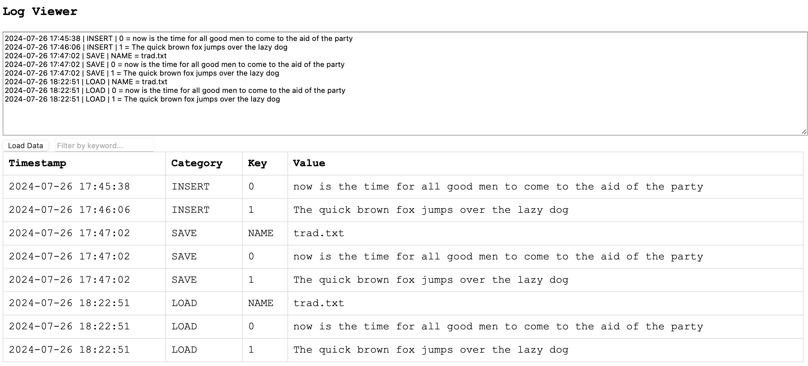

# Virtual Machines


## Logging

As previously stated, logging is a tool with many aspects and uses.
Here, we demonstrate this by using a *line editor*. A line editor was
once very common in the past. It was easy to implement and versatile,
making it effective for editing text files. As long as the files
weren’t too large, it wasn’t too difficult to use. We will not delve
into the specifics of line editors, as that is not our aim here.
Instead, we want to illustrate how logging can benefit even editors.
In this case, you can have the *entire history of edits* saved. From
the saved file, you can, in principle, work backwards in steps, undo
edits, or even choose not to save the file at all. The log would
contain enough information to restore the session and continue from
where you left off, even if you just quit the editor.


### ed.py

We start off with a very simple line editor 'ed.py'. It can load text
files, view them, insert a line, delete a line, edit a line, save the
file. The bare necessities.


### ed2.py

The second editor 'ed2.py' have a built in logger.
Hardcoded 'log.txt'.


```log
2024-07-26 19:57:36 | LOAD | NAME = trad.txt
2024-07-26 19:57:36 | LOAD | 0 = The quick brown fox jumps over the lazy dog
2024-07-26 19:57:36 | LOAD | 1 = To be or not to be ..
2024-07-26 19:58:47 | INSERT | 2 = .. is the question
2024-07-26 19:59:03 | DELETE | 0
2024-07-26 19:59:18 | SAVE | NAME = trad.txt
2024-07-26 19:59:18 | SAVE | 0 = To be or not to be ..
2024-07-26 19:59:18 | SAVE | 1 = .. is the question
```




### viewlog.html


### playlog.html


## Assembling & disassembling


