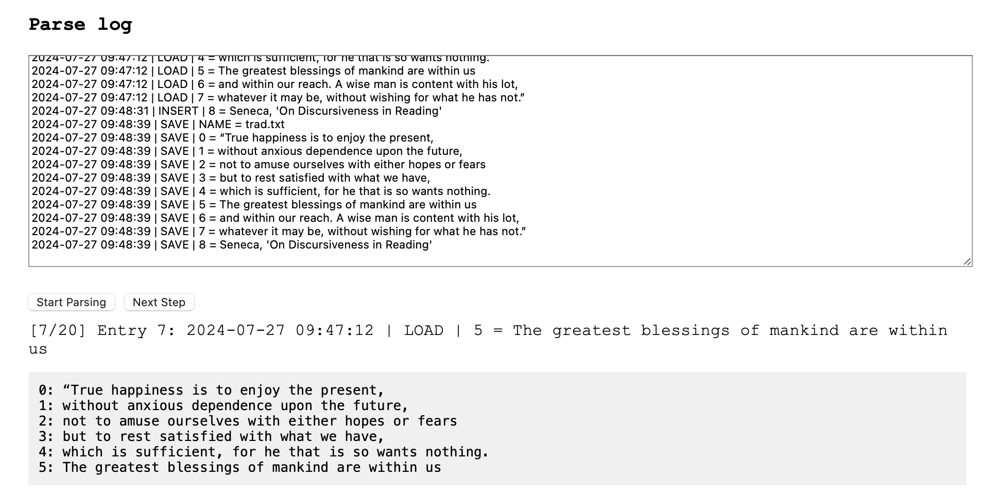

# Virtual Machines


## Logging

*This section is intended to highlight that the principles of
application and system development should not be compartmentalized.
Tools like loggers, commonly used in systems, can also be highly
beneficial in other applications. For example, integrating a logger
into an editor can be very useful.*

As previously stated, logging is a tool with many aspects and uses.
Here, we demonstrate this by using a *line editor*. A line editor was
once very common in the past. It was easy to implement and versatile,
making it effective for editing text files. As long as the files
weren’t too large, it wasn’t too difficult to use. We will not delve
into the specifics of line editors, as that is not our aim here.
Instead, we want to illustrate how logging can benefit even editors.
In this case, you can have the *entire history of edits* saved. From
the saved file, you can, in principle, work backwards in steps, undo
edits, or even choose not to save the file at all. The log would
contain enough information to restore the session and continue from
where you left off, even if you just quit the editor. Todays 
computer may be fast enough to not corrupt saving the log, so in
principal it should work ok.


### Line editor

We start off with a very simple line editor 'ed.py'. It can load text
files, view them, insert a line, delete a line, edit a line, save the
file. The bare necessities.

In short `load_file` loads the content of the file into `self.lines`,
while `save_file` saves the current lines to the current file. The
`view` displays the content of the file with line numbers. The
functions take a more closer approach `edit` replaces a specific line
with new content, `insert` inserts new content at a specific line, and
`delete` deletes a specific line. Next `run` is the main loop to handle
user commands "view, edit, insert, delete, load, save, exit".


### Line editor with logger

The second editor 'ed2.py' includes a built-in *logger*, which distinguishes it
from 'ed.py'. Despite this improvement, the functionality remains largely
similar to the previous version. There are always room for improvement,
but cut off with regards to pegagogical values.[^flawed] The 'log.txt'
is hardcoded for every text that runs through the editor. Logs are usually
custom-built and may vary in format. Here they appear as follows:

[^flawed]: The logs are significantly flawed and redundant. The log file
can grow immensely in proportion to the files they track. For example,
a saved file is fully represented in the log file both when it is
loaded and saved.

```log
2024-07-27 09:47:12 | LOAD | NAME = trad.txt
2024-07-27 09:47:12 | LOAD | 0 = “True happiness is to enjoy the present,
2024-07-27 09:47:12 | LOAD | 1 = without anxious dependence upon the future,
2024-07-27 09:47:12 | LOAD | 2 = not to amuse ourselves with either hopes or fears
2024-07-27 09:47:12 | LOAD | 3 = but to rest satisfied with what we have,
2024-07-27 09:47:12 | LOAD | 4 = which is sufficient, for he that is so wants nothing.
2024-07-27 09:47:12 | LOAD | 5 = The greatest blessings of mankind are within us
2024-07-27 09:47:12 | LOAD | 6 = and within our reach. A wise man is content with his lot,
2024-07-27 09:47:12 | LOAD | 7 = whatever it may be, without wishing for what he has not.”
2024-07-27 09:48:31 | INSERT | 8 = Seneca, 'On Discursiveness in Reading'
2024-07-27 09:48:39 | SAVE | NAME = trad.txt
2024-07-27 09:48:39 | SAVE | 0 = “True happiness is to enjoy the present,
2024-07-27 09:48:39 | SAVE | 1 = without anxious dependence upon the future,
2024-07-27 09:48:39 | SAVE | 2 = not to amuse ourselves with either hopes or fears
2024-07-27 09:48:39 | SAVE | 3 = but to rest satisfied with what we have,
2024-07-27 09:48:39 | SAVE | 4 = which is sufficient, for he that is so wants nothing.
2024-07-27 09:48:39 | SAVE | 5 = The greatest blessings of mankind are within us
2024-07-27 09:48:39 | SAVE | 6 = and within our reach. A wise man is content with his lot,
2024-07-27 09:48:39 | SAVE | 7 = whatever it may be, without wishing for what he has not.”
2024-07-27 09:48:39 | SAVE | 8 = Seneca, 'On Discursiveness in Reading'
```


### A log viewer

Long logs can be challenging to navigate. A dedicated viewer `viewlog.html`
with filtering or sorting options can make this process easier. While text
files may not present many obstacles, programming languages or machine code
often benefit significantly from such specialized tools.


### A playback viewer

In this case with a line editor that have a *recording log*, a *playback
viewer* `playlog.html` will illustrate how a textfile gets created. As can
be understood from this, versioning, alternate copies, and other reconizable
properties from e.g. versioning software could in principle also be added.



Thus logging is often a system tool, but it capture ideas that can be use
in many other ways.


## Assembling & disassembling

Taking an assembler from previous, we can turn it into something which
analyses our "machine code", a disassembler. It reverses the process,
takes the integers and turn them into easier to understandable mnemonics,
the "assembly language".


### Disassembler: disasm.py
