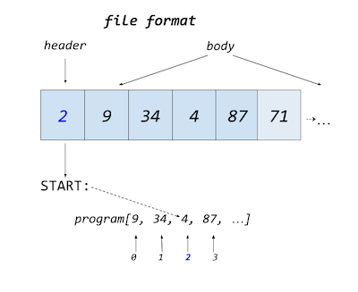

# Virtual Machines

The virtual machine consists of essentially two files plus header files. The real
point of the virtual machine is to seperate running from the construction of the
runnable.

We have a machine in `enkelvm.c` and `enkelvm.h`, and loading code and directing
the machine is done through `runvm.c`. The only thing to be added is the "binary"
code for the program.

## runvm

The limits of the machine are defined in the runner `runvm.c`. Variables, globals, 
stack, etc. are set from the start. Will it hit a wall, and you have the hardware,
the limits might be changed by you.

Before loading, the length of the input file is measured. The "binary" have integers
seperated by commas, throughout. It also in a certain format, where the first number
points to where the *vm* should start. The rest of the file is the program itself.

A header of one (1) integer (separeted with a comma before the body) signals
where to start. The rest is read in an array to be executed, starting at the
postition where the `START` label was poiting before the assembler did its thing.

The runner measures the time from when the program starts until it finishes, and
prints the duration.

...

## vmenkel

The virtual machine has in main been described earlier, and not much have changed.
