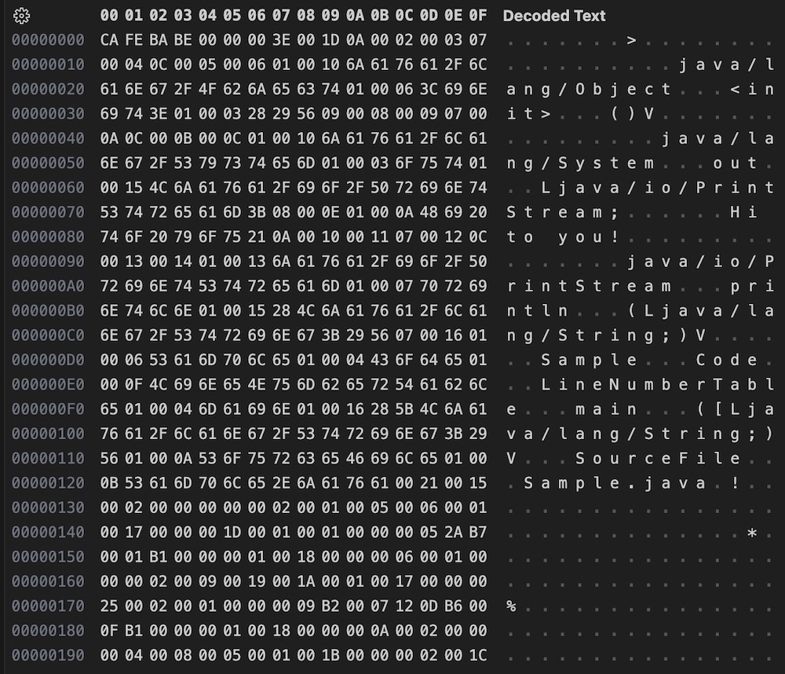
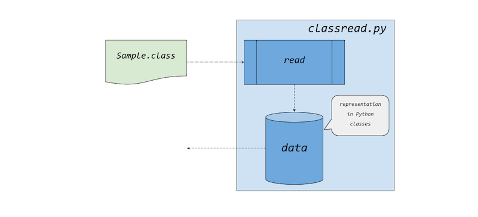

# Virtual Machines

*Java Virtual Machine* and/or *Java* might be the best well known implementation
of a virtual machine. I started with Java when it first came out as beta in 1995.
You could then download Java and its tools, if you adhere to it from a educational
viewpoint. I dived into Java, and wrote a simple introduction in 1997 to the language
which was printed and reprinted in a total of 16.000 copies.[^progjava] I was invited
as a journalist to JavaOne, San Fransisco, in 1999. Java was hot and exciting.
But I wasn't the only one  absorbed with the apparent future. The web was growing
quite fast, and Java promised to deliver a way to work with programs across the web
we didn't see from elsewere. Today it's quite another story, and maybe Java will
fade as things change. But that's another story ...

[^progjava]: Lonnert, Set, *Programmering i JAVA*, 1. utg., KnowWare Publ., Bromma,
1997-, and also https://libris.kb.se/bib/2324301.
Unfortunately it is here spelled as 'JAVA' instead of the correct 'Java'.
Why, I have no idea, but it is not an abbreviation, such as 'BASIC' for instance is
Beginners' All-purpose Symbolic Instruction Code.


## preparation

First, for obvious reasons, this will not be a full or even partial
implementation of Java, or even of a proper JVM (Java Virtual Machine).
The aim here is to illustrate some aspects of the ideas that was introduced
with the JVM, and hence Java back in 1995.[^copy]

[^copy]: The prototype here will not even be called a 'JVM' because it is
trademarked/copyrighted by Sun/Oracle. There are now adays also proper
verifications routines for these machines to guarantee
(or be as secure as you can) for a proper use, where it used to be only a
"routine" in natural language.
The official machine HotSpot is highly optimized
and requires in depth learning to get aquainted with.
See e.g. https://docs.oracle.com/en/java/javase/20/vm/java-virtual-machine-guide.pdf
and also https://github.com/openjdk/jdk/tree/master/src/hotspot.
(There is also OpenJDK: https://openjdk.org/, which is the open source
version of Java.)
Futher, there should be no need to install Java, if you do not desire
to do so to e.g. experiment with your own classes. The classes discussed
are compiled anc can be found in the directory [classes](jvm1/classes).

To amend problems with different implementations of virtual machines,
a *specification* will be helpful. On the other hand, for our purpose as
a pedagogical tool, the specification for Java is today quite intricate and
voluminous.[^javaspec] It is simply not practical to write a JVM in this
context. However, stripping the spec down to only some details for
implementation, the result might enlighten the reader/coder of how a
reasonable modern virtual machine works.

[^javaspec]: Specifications of versions of JVM: https://docs.oracle.com/javase/specs/index.html

An assumption here is that Java[^javawiki] is well known for its principals,
a virtual machine for running bytecodes, a compiler which translate for a
Java-program to a sequence of bytecodes. *Sounds familiar?* Previous samples
of virtual machines have had a string of *integers* as the minimal information
encoded and decoded between machine and compiler (or raw code). Another
similarity is the separation of language from the machine, which implies
the benefits of explicit interfaces. There can be different languages that
can run on the same machine, as there can be different implementations of
the machine adjusted for different hardwares.

The basis for Java starts with the interface between the virtual machine and
what comes out of the compiler: the `bytecode`,[^bytecodewiki] or its physical
representation in the `class file`.[^classfilewiki]

[^javawiki]: https://en.wikipedia.org/wiki/Java_(programming_language), and
https://en.wikipedia.org/wiki/Java_(software_platform).

[^bytecodewiki]: https://en.wikipedia.org/wiki/Java_bytecode
[^classfilewiki]: https://en.wikipedia.org/wiki/Java_class_file


### java and javac

Let's take a most simple example to illustrate what takes place when you use Java
in programming. The source (code) is written in simple text, here saved as a text
file 'Sample.java'.[^javaversion]

[^javaversion]: These samples have been compiled and examined with tools from
version Java 18.0.2.1.

```java
public class Sample {
    public static void main(String[] args) {
        System.out.println("Hi to you!");
    }
}
```

This sample should be rather straightforward as it prints "Hi to you!" at the prompt
when it runs. The source should be familiar from C, from which it borrows a lot, e.g.
the 'main' entry starting point. What might be considered as the "new" thing
that might be odd to the reader here is the object-oriented concept of 'class'.
This aspect of object-orientation will really not be touched much futher here
than elementary bits of object, class, superclass, etc. which the reader must
certainly is already acquainted with.

We use tools for manipulating this program by compiling it with `javac` and then
running the compiled file with `java`. In this case an interaction with
the tools might look like this:

```console
> javac Sample.java
> java Sample
Hi to you!
```

First we convert the textfile with `javac Sample.java` with the text file as
argument, to a new file. If we were to list the content of the directory after
compilation `javac`, an additional file would appear 'Sample.class' as the
result from the compilation.

Running this latter class file (without assigning the extension '.class') as
above would result in a message to the console being printed "Hi to you!".

These are the two elementary steps in building a Java program:
* compile tool `javac`,
* and the run tool `java`.


### sample class

The class file can be displayed in 'hexadecimal' and in ASCII:



Already here is a lot of information conveyed in ASCII. We can already see that
much of the understandable source is included in the class file.
If we know about Java we can see other things such as the type of a return value,
native (library) methods called for printing, etc.

With official releases of Java there comes another tool:
* the disassembler tool `javap`.

And if we disassemble `Sample.class` with the tool `javap` with option `-c`,
we get:

```console
> javac Sample.java
> javap -c Sample.class
Compiled from "Sample.java"
public class Sample {
  public Sample();
    Code:
       0: aload_0
       1: invokespecial #1                  // Method java/lang/Object."<init>":()V
       4: return

  public static void main(java.lang.String[]);
    Code:
       0: getstatic     #7                  // Field java/lang/System.out:Ljava/io/PrintStream;
       3: ldc           #13                 // String Hi to you!
       5: invokevirtual #15                 // Method java/io/PrintStream.println:(Ljava/lang/String;)V
       8: return
}
```


### another sample

The sample 'Sample.java' above isn't however delivering much to inform us about the
byte code executable instructions that are familiar to us from previously, as they
mosly refer to invoking calls to procedures (or equivalent) in the native machine,
and also referes to other classes. (More on this below.)

We could however use another sample to illustrate how two numbers can be added.

```java
public class Add {
    public static void main(String[] args) {
        System.out.println(add(23, 45));
    }
    public static int add(int a, int b) {
        return a + b;
    }
}
```

Disassembled code:

```console
> javac Add.java
> javap -c Add.class
Compiled from "Add.java"
public class Add {
  public Add();
    Code:
       0: aload_0
       1: invokespecial #1                  // Method java/lang/Object."<init>":()V
       4: return

  public static void main(java.lang.String[]);
    Code:
       0: getstatic     #7                  // Field java/lang/System.out:Ljava/io/PrintStream;
       3: bipush        23
       5: bipush        45
       7: invokestatic  #13                 // Method add:(II)I
      10: invokevirtual #19                 // Method java/io/PrintStream.println:(I)V
      13: return

  public static int add(int, int);
    Code:
       0: iload_0
       1: iload_1
       2: iadd
       3: ireturn
}
```

Especially the last part here is instructive. If we combine descriptions of
the instructions,[^instrwiki] with the above we get a familiar picture:

```text
       0: iload_0        // load an int value from local variable 0  --> 1A
       1: iload_1        // load an int value from local variable 1  --> 1B
       2: iadd           // add two ints                             --> 60
       3: ireturn        // return an integer from a method          --> AC
```

[^instrwiki]: https://en.wikipedia.org/wiki/List_of_Java_bytecode_instructions

You can find the equivalent core encoded in the class file as '1A 1B 60 AC' in
hexadecimal. The instruction 'iload_0' is '1A' and so on.


## jvm1


### reading class files

Class files are structured in a certain way to ease reading and interpreting
code. Each file starts with a "magic number" which is in hexadecimal 'CAFEBABE',
cf. the hexdump above. This is a very common way for identifying files. E.g.
PDF can start with 'PDF-1.3', where a version number follows. Or, for RTF
(Rich Text Format) there is a start with '{\rtf1' or something like this,
and then other instructions of the format for text follows. In this way a
file can even be identified without an extension to the file.

Here is a small script to show the start of a class file, and hardcoded
for reading 'Sample.class' to have it short.

```python
# reading sample Java class
# classread-sample.py

import struct

with open("Sample.class", "rb") as cf:

    # cafebabe
    magic = struct.unpack('!I', cf.read(4))
    print(f"magic: {hex(magic[0])}")

    # version
    minor, major = struct.unpack('!HH', cf.read(4))
    print(f"version: {major}.{minor}")
```

We can compare this to what we can find in the specification:[^specmagic]

[^specmagic]: https://docs.oracle.com/javase/specs/jvms/se20/html/jvms-4.html

> #### magic
> The magic item supplies the magic number identifying the class file format; it has the value 0xCAFEBABE.

> #### minor_version, major_version
> The values of the minor_version and major_version items are the minor and major version numbers of this class file. Together, a major and a minor version number determine the version of the class file format. If a class file has major version number M and minor version number m, we denote the version of its class file format as M.m. Thus, class file format versions may be ordered lexicographically, for example, 1.5 < 2.0 < 2.1.

> A Java Virtual Machine implementation can support a class file format of version v if and only if v lies in some contiguous range Mi.0 ≤ v ≤ Mj.m. The release level of the Java SE platform to which a Java Virtual Machine implementation conforms is responsible for determining the range.

Thus we can build in similar ways upon the specification for
reading, storing, and executing code.


### getting into some more detail

The file format for classes besides the above, have a large part called the
'constant pool', data fields, methods, and a list of attributes.
If we limit the sample to just a static method in a class, with a simple
multiplication operation:

```java
public class Mul {
    public static int mul(int a, int b) {
        return a * b;
    }
}
```

The disassembly might be easier to decode:

```console
> javac Mul.java
> javap -v Mul.class
Classfile /Users/user/Documents/jdk/Mul.class
  Last modified 30 aug. 2023; size 236 bytes
  SHA-256 checksum 0beea4fe71e627f6d7acc6a5e49ad233b05fa35aa186a1358e1fe186d7c06900
  Compiled from "Mul.java"
public class Mul
  minor version: 0
  major version: 62
  flags: (0x0021) ACC_PUBLIC, ACC_SUPER
  this_class: #7                          // Mul
  super_class: #2                         // java/lang/Object
  interfaces: 0, fields: 0, methods: 2, attributes: 1
Constant pool:
   #1 = Methodref          #2.#3          // java/lang/Object."<init>":()V
   #2 = Class              #4             // java/lang/Object
   #3 = NameAndType        #5:#6          // "<init>":()V
   #4 = Utf8               java/lang/Object
   #5 = Utf8               <init>
   #6 = Utf8               ()V
   #7 = Class              #8             // Mul
   #8 = Utf8               Mul
   #9 = Utf8               Code
  #10 = Utf8               LineNumberTable
  #11 = Utf8               mul
  #12 = Utf8               (II)I
  #13 = Utf8               SourceFile
  #14 = Utf8               Mul.java
{
  public Mul();
    descriptor: ()V
    flags: (0x0001) ACC_PUBLIC
    Code:
      stack=1, locals=1, args_size=1
         0: aload_0
         1: invokespecial #1                  // Method java/lang/Object."<init>":()V
         4: return
      LineNumberTable:
        line 2: 0

  public static int mul(int, int);
    descriptor: (II)I
    flags: (0x0009) ACC_PUBLIC, ACC_STATIC
    Code:
      stack=2, locals=2, args_size=2
         0: iload_0
         1: iload_1
         2: imul
         3: ireturn
      LineNumberTable:
        line 4: 0
}
SourceFile: "Mul.java"
```

Starting at the end, we will leave some text unexplained,
but under 'Code' we find the core of what the class does:
*multiplies two integers and returns the resulting integer*.
We can see that primitive types, i.e. here integers, have
direct representation in the instructions. Multiplications
of integers have a special single instruction. We also find
the number of arguments as '2' which should go in the method.
Futher we can see something for the stack as '2' and also for
'locals' as '2'. The machine can here pop a value from the
stack and put it in a local variable when executing a 'load'
instruction for the primitive type. The primitive types
can be dealt with more directly or indirect depending on
hardware, adding not only integers, but also floats or 
doubles in floting point representations. This openess or fuzziness
is actually not as bad as one might think. The specification
for JVM is open to different implementations, e.g. both as a
stack and/or as registers for these local variables/arguments.
Special hardware could make use of this *conceptual specification*,
rather than having a description of a reference implementation,
for memory or speed considerations.

There is only one method in the class 'Mul', which is called 'mul'.
The disassembly shows that there are two? Well, there is a 'hidden'
constructor that can be called for the class. The constructor of a
class is included by the compiler and invoked as a call to `<init>`.
The minimum required to call `<init>` is `aload_0` which instructs
the runtime to load the local reference at index 0 of the current
frame.[^frames]
The frame contains a reference to `<java/lang/Object.<init>>`.
The next instruction `invokespecial #1` is a 'special' instance
call that calls referenced as #1. Then there is at last a return from
the creation.

[^frames]: A 'frame' have many similarities to what we have called 'activation
records' previously. But 'frames' here are more complex as it e.g.
handle data for threads. On more of this see e.g.
https://www.artima.com/insidejvm/ed2/jvm8.html

The 'constant pool' have some similarities to a symbol table, but
it is for the 'class'. The constant pool contains e.g. names of
classes referenced, initial values of strings/numeric constants,
and other things. The class loader must e.g. identify other
referenced classes for loading, which here are explicit names
(paths) for them.

Much more information can be deduced, but we will stop at this.


### the constant pool

If we have a closer look at a simple *implementation*
'classread-constant-pool.py' to the corresponding *specification*
https://docs.oracle.com/javase/specs/jvms/se7/html/jvms-4.html
(also noted with in comments in the code), we can see that they are
close enough to give us insights of the benefits from good specifications.
Java has though suffered from bad implementations at times (included
this one, but now for good educational reasons). Therefore things such
as automated verifications, extended control over the implementation
or hardened editions from one vendor might also be parts of the actual
software *in production*.

The program 'classread-constant-pool.py' gives us a little more
information than previously (cf. above with `javap`):

```console
> python3 classread-constant-pool.py -v -i Mul.class
reading ..
version: 0.62
#01 10: (2, 3)
#02  7: 4
#03 12: (5, 6)
#04  1: java/lang/Object
#05  1: <init>
#06  1: ()V
#07  7: 8
#08  1: Mul
#09  1: Code
#10  1: LineNumberTable
#11  1: mul
#12  1: (II)I
#13  1: SourceFile
#14  1: Mul.java
done.
```

In this program 'classread-constant-pool.py' only *some* of the first bytes are processed:
'magic', 'minor_version', 'major_version', 'constant_pool_count' and 'cp_info'. We ignore
the rest for the moment. If we glance at the specification there are lot of other information
still there.

```text
ClassFile {
    u4             magic;
    u2             minor_version;
    u2             major_version;
    u2             constant_pool_count;
    cp_info        constant_pool[constant_pool_count-1];
    u2             access_flags;
    u2             this_class;
    u2             super_class;
    u2             interfaces_count;
    u2             interfaces[interfaces_count];
    u2             fields_count;
    field_info     fields[fields_count];
    u2             methods_count;
    method_info    methods[methods_count];
    u2             attributes_count;
    attribute_info attributes[attributes_count];
}
```

The 'constant pool' is used by other entries in the class. This becomes more clear as
we parse the rest.

The constant pool have an encoding, a `tag` indicate how the following value should be
interpreted. This table show the tags and the encoding.

| Tag  | Encoded as |
| ------------- | ------------- |
| CLASS  | 7  |
| FIELDREF  | 9  |
| METHODREF  | 10  |
| INTERFACEMETHODREF  | 11  |
| STRING  | 8  |
| FLOAT  | 3  |
| LONG  | 4  |
| DOUBLE  | 5  |
| NAMEANDTYPE  | 12  |
| UTF8  | 1  |
| METHODHANDLE  | 15  |
| METHODTYPE  | 16  |
| INVOKEDYNAMIC  | 18  |


### more information

If we try to convert even more with another reader 'classread.py' we get:

```console
> python3 classread.py -v -i Mul.class
reading ..
version: 0.62
#01 10: (2, 3)
#02  7: 4
#03 12: (5, 6)
#04  1: java/lang/Object
#05  1: <init>
#06  1: ()V
#07  7: 8
#08  1: Mul
#09  1: Code
#10  1: LineNumberTable
#11  1: mul
#12  1: (II)I
#13  1: SourceFile
#14  1: Mul.java
flags: 0x0021
this class name: Mul
super class name: java/lang/Object
method: 0x0001 <init> ()V
attribute: Code: b'\x00\x01\x00\x01\x00\x00\x00\x05*\xb7\x00\x01\xb1\x00\x00\x00\x01\x00\n\x00\x00\x00\x06\x00\x01\x00\x00\x00\x02'
method: 0x0009 mul (II)I
attribute: Code: b'\x00\x02\x00\x02\x00\x00\x00\x04\x1a\x1bh\xac\x00\x00\x00\x01\x00\n\x00\x00\x00\x06\x00\x01\x00\x00\x00\x04'
attribute: SourceFile b'\x00\x0e'
done.
```

First there is a table number (unique entries), then the previously mentioned tag, a colon, and the value.
If we extract some lines from above:

```text
..
#07  7: 8           // Class    #8
#08  1: Mul         // UTF8     Mul
..
```

```text
..
this class name: Mul
..
```

Now, let's have a look at how to get the class name 'Mul':

```python
# this class name
class This():
    def __init__(self, class_name):
        self.class_name = class_name
    def __str__(self) -> str:
        return f"this class name: {self.class_name}"

def parse_this(f, constant_pool):
    this_class = struct.unpack('!H', f.read(2))
    ref = constant_pool[this_class[0] - 1].value
    class_name = constant_pool[ref - 1].value
    this = This(class_name)
    return this
```

Reading from the file in sequence we get to where there is supposed to be "this class name".
We can see that at '#07' there is a code '7' which means 'Class' (look at the source of 'classread.py').
This appears exactly at the place where the class name should be indicated according to the specification.
The reference then (8) points to '#08' of tag type '1' which is UTF8 and the value is 'Mul'.
Hence *Mul* is the name of the *class*.



