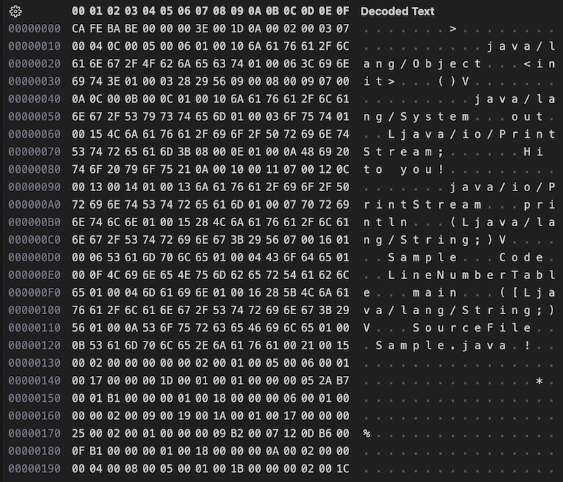

# Virtual Machines

*Java Virtual Machine*


## jvm1

To amend problems with different implementations of virtual machines,
a specification would be helpful. On the other hane, for our purpose as
a pedagogical tool, the specification for Java is today quite intricate and
voluminous.[^javaspec] However, stripping some details it might enlighten
the reader/coder of how a reasonable modern virtual machine works in principal.

[^javaspec]: Specifications of versions of JVM: https://docs.oracle.com/javase/specs/index.html

An assumption here is that Java[^javawiki] is well known for its principals,
a virtual machine for running bytecodes, a compiler which translate for a
Java-program to a sequence of bytecodes. *Sound familiar?* Previous samples
of virtual machines have had a string of *integers* as the minimal information
encoded and decoded between machine and compiler (or raw code).

The basis for Java starts with the interface between the virtual machine and
what comes out of the compiler: the `bytecode`, or its physical representation
in the `class file`.[^classfilewiki]

[^javawiki]: https://en.wikipedia.org/wiki/Java_(programming_language)

[^classfilewiki]: https://en.wikipedia.org/wiki/Java_class_file


### sample

Let's take a most simple example to illustrate what takes place when you use Java
in programming. The source (code) is written in simple text, here saved as a text
file.

```java
public class Sample {
    public static void main(String[] args) {
        System.out.println("Hi to you!");
    }
}
```
We use tools for manipulating this by compiling it with `javac` and then
running the compiled file with `java`. In this case an interaction with
the tools might look like this:

```
> javac Sample.java
> java Sample
Hi to you!
```

First we convert the textfile with `javac Sample.java` with the text file as
argument to a new file. If we were to list the content of the directory after
compilation (`javac`), an additional file would appear `Sample.class` as the
result from compilation.

Running this class file (without assigning the extension `.class`) as above would
result in a message to the console being printed "Hi to you!".

These are the two elementary steps in building a Java program.

The class file can be displayed as hex and ASCII:



Already here is a lot of information. We can already see that much of the
understandable source is included in the class file.

And if we disassemble `Sample.class` with the tool `javap` with option `-c`:

```text
Compiled from "Sample.java"
public class Sample {
  public Sample();
    Code:
       0: aload_0
       1: invokespecial #1                  // Method java/lang/Object."<init>":()V
       4: return

  public static void main(java.lang.String[]);
    Code:
       0: getstatic     #7                  // Field java/lang/System.out:Ljava/io/PrintStream;
       3: ldc           #13                 // String Hi to you!
       5: invokevirtual #15                 // Method java/io/PrintStream.println:(Ljava/lang/String;)V
       8: return
}
```
