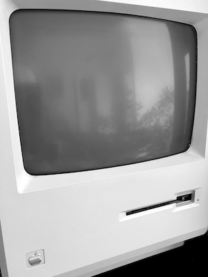

# Apple, PostScript, PDF and screen rendering

Based on the background of [PostScript](POSTSCRIPT.md), in the mid-80s,
Apple achieved significant success early with the introduction of “affordable”
laser printers and software programs like PageMaker. These programs allowed
users to layout pictures, text, and graphics. Additionally, PostScript
enabled the transfer of what was seen on the screen to be printed in
relatively high detail, such as 300 dpi.

Interesting enough the LaserWriter had a Motorola 68000 at 12 MHz,
and memory of 1.5 MB, while a typical MacPlus had a Motorola 68000
at 8 Mhz with a memory starting at 1 MB RAM, but, to my experience,
often was upgraded with 2 or 4 in the late 80s.

Initially, the Macintosh did not have a strong start upon its launch.
However, desktop publishing (DTP) and other software made it a much
more appealing product in critical markets at the right time.

## PDF renders PostScript a bit obsolete ..

Later on, PostScript was succeeded by PDF (Portable Document Format),
which can be easily “distilled” or converted from PostScript. PDF
inherits many ideas from PostScript, but it has evolved significantly.
It is designed with a different focus, making it suitable not only for
printing but also for viewing on screens.[^pdf] Yes, it converted
from a __programming language__ to a __portable document format__.

But here comes the interesting part: *PDF played a significant role in
screen rendering and display within Apple's operating systems,
particularly starting from Mac OS X, which arrived in 2001.*[^dropped]

[^pdf]: https://en.wikipedia.org/wiki/PDF

[^dropped]: As a side note: Apple dropped support for converting PostScript
to PDF recently, as you previously just had to click on a ".ps" file to get
a ".pdf". And, I was also a bit disappointed when I started programming
in Objective-C for iOS, as there were more orientation towards "bitmaps"
than "vector graphics" in the GUI at that time (2015). And from what I
understand in simplified terms, Apple's graphical systems have much of
faster cache solutions in bitmaps, than drawing (procedural) vector graphics.

### Display PostScript[^displayps]

This was no coincidence. Let's go back a bit in time. Steve Jobs
was fired/quit from Apple in 1985, but then started NeXT Computer
Inc.[^next] Thus he didn't really experience the growth of DTP
when he was at Apple. Steve was instrumental in getting PostScript
to Apple, even to the point of trying to purchase Adobe, but with
no success. At NeXT he realised he could implement the potential
of having vector based screen rendering on a computer.

So *Display PostScript* (DPS) was a technology developed by
Adobe Systems in collaboration with NeXT during
the late 1980s and early 1990s, first lauched in 1987.
It aimed to extend the capabilities of traditional PostScript
by adding support for interactive graphics and user interface
elements, making it suitable for on-screen display and user
interaction. That is, a little bit more complex than only rendering.

[^displayps]: https://en.wikipedia.org/wiki/Display_PostScript
[^next]: https://en.wikipedia.org/wiki/NeXT

Display PostScript became integral to NeXT’s operating system,
NEXTSTEP, which was renowned for its graphical user interface
(GUI) and object-oriented development environment. And as is
known, *MacOS X* inherited *a lot* from what it once was based on:
NEXTSTEP.[^nextstep]

DSP laid the foundation for Adobe’s later development of both
Adobe Display PostScript (ADPS) and Portable Document Format
(PDF).

[^nextstep]: https://en.wikipedia.org/wiki/NeXTSTEP

Apple’s adoption of PDF for its rendering engine in *macOS*
highlighted PDF’s strengths, providing a unified approach
to rendering that served equally well for on-screen display,
printing, and document exchange. All in one.

#### Side note: The early web
Tim Berners-Lee, known for inventing the web, programming the
first web server, also developed the first web browser called
WorldWideWeb[^www] on a NeXT computer. Interestingly, in the early
versions of the browser, PostScript was included as a part of
it. Or, maybe rather, the browser could handle PostScript but
the real handling was done elsewhere in the operating system.
However, PostScript was not an open standard; it was
*proprietary*. Thus it might have too limiting for many developers,
or implementations might have very been costly. That in contrast
to the markup SGML[^sgml] standard that much of HTML stems from.
The browser also featured many other capabilities such as (locally)
editable pages and bidirectional links, among other advanced
features. To make the web more appealing and easier to implement,
many features were initially omitted. In hindsight, some of these
omissions may have been regrettable.

[^www]: About: https://www.w3.org/People/Berners-Lee/WorldWideWeb.html
Source code: https://www.w3.org/History/1991-WWW-NeXT/Implementation/
[^sgml]: https://en.wikipedia.org/wiki/Standard_Generalized_Markup_Language

### PDF in Apple's GUI

**Core Graphics (Quartz 2D)**: Apple's Core Graphics framework[^coredoc],
known as *Quartz 2D,*[^quartz2ddoc] is the cornerstone of their graphics
rendering engine in macOS. Quartz 2D is based on the same *imaging model*
as *PDF*. This allows the operating system to render text and graphics
with high precision and consistency, using the same techniques for both
screen display and printing.

[^coredoc]: https://developer.apple.com/documentation/coregraphics

[^quartz2ddoc]: https://developer.apple.com/library/archive/documentation/GraphicsImaging/Conceptual/drawingwithquartz2d/Introduction/Introduction.html

**Resolution independence**: PDF's scalable nature means that graphics
and text can be rendered at (for the most part) any reasonable resolution
without loss of quality. This was a critical feature for Apple's GUI,
ensuring that elements would look sharp and clear on displays with
varying resolutions, including the high-resolution *Retina displays*
introduced later.

**Consistent output**: Using PDF as a basis for on-screen rendering
ensures that the visual output is consistent across *different devices*.
This is similar to the WYSIWYG (What You See Is What You Get) principle
that PostScript brought to desktop publishing. What users see on their
screen is a faithful representation of what will be printed or displayed
on another device.

**Advanced graphics**: PDF supports advanced graphics features such as
transparency, gradients, and complex vector shapes. By utilizing PDF
for rendering, Apple's GUI could incorporate these advanced graphics
features seamlessly, enhancing the visual appeal and functionality
of the user interface.

**Performance optimization**: Apple's implementation of PDF for
rendering is optimized for performance, ensuring smooth and responsive
interactions within the GUI. The efficient handling of vector graphics
and text rendering helps maintain a high frame rate and responsiveness,
even with complex visuals. (But more on this later.)

**Compatibility & integration**: PDF is a widely used standard for
document exchange, and by using it as a basis for their rendering engine,
Apple ensured that documents created or viewed on *macOS* would be highly
compatible with other systems and applications. This integration makes it
easier for users to work with PDF documents directly within the operating
system, including previewing, annotating, and printing.

## Going Metal[^metaldoc] ..

As of recent developments, Apple has indeed evolved its graphics rendering
architecture, moving away from a strictly PDF-based approach for certain
aspects of screen buffering and rendering. Here’s an overview of the current
situation and how Apple’s graphics architecture has shifted:

[^metaldoc]: https://developer.apple.com/documentation/metal

### Changes and Evolution

1. **Metal Framework**:
    - **Introduction**: Apple introduced Metal, a low-level, high-performance
    graphics API, in 2014 with iOS 8 and later expanded it to macOS. Metal
    provides direct access to the GPU, allowing for more efficient rendering
    and greater control over graphics performance.
    - **Use cases**: Metal is used extensively for rendering complex graphics
    and animations in games, professional applications, and system-level
    rendering tasks where *high performance* is critical.
    - **Screen rendering**: For many modern applications, especially those
    requiring intensive graphics, Metal is used *instead* of traditional PDF-based
    rendering.

2. **Core Animation and Core Graphics**:
    - **Core Animation**: Core Animation remains a fundamental part of macOS
    and iOS for managing animations and smooth transitions. It interfaces
    with both Metal and Core Graphics to provide high-performance, visually
    appealing animations.
    - **Core Graphics (Quartz 2D)**: While still integral for many 2D
    rendering tasks, Core Graphics now often works in conjunction with
    Metal for improved performance and flexibility. The use of PDF for
    certain tasks persists, but it is not the sole method for all
    rendering operations.

3. **Hybrid Approach**:
    - **PDF for document rendering**: PDF is still heavily used for document
    rendering and manipulation within macOS and iOS. Apps that handle
    documents, such as Preview and third-party PDF viewers, leverage the
    PDF capabilities of Core Graphics for accurate rendering and editing.
    - **Metal for performance-critical tasks**: For tasks that require high
    performance, such as real-time graphics, complex UI elements, and advanced
    animations, Metal is preferred due to its efficiency and direct access
    to GPU resources.

4. **Layered Architecture**:
    - **UI rendering**: The UIKit and AppKit frameworks (for iOS and macOS,
    respectively) utilize a layered rendering architecture where higher-level
    abstractions may still use PDF-based rendering internally, but lower-level
    operations are often offloaded to Metal for performance.
    - **Compositing and effects**: Compositing and visual effects are areas
    where Metal’s capabilities are leveraged to provide smooth and efficient
    rendering, particularly on high-resolution displays and in graphics-intensive
    applications.

### Differences in API Usage

- **Level of abstraction**: Metal provides a lower-level API with more
explicit control over rendering operations and resource management,
while Core Graphics offers a higher-level, more abstracted API focused
on ease of use for 2D graphics and PDF rendering.

- **Performance and use cases**: Metal is designed for high-performance,
real-time applications requiring direct GPU access. In contrast, Core
Graphics is tailored for applications involving vector graphics and
document rendering, where ease of use and integration with the system’s
UI framework are more important.

- **Resource management**: Metal requires explicit management of GPU
resources, synchronization, and command encoding, whereas Core Graphics
handles many of these aspects automatically, providing a simpler but
less flexible drawing model.

### Conclusion

While Apple has not completely abandoned PDF-based rendering, especially for
document handling and certain UI elements, it has significantly expanded its
graphics architecture to incorporate Metal for high-performance rendering tasks.
This hybrid approach allows Apple to maintain the strengths of PDF for certain
applications while leveraging the advanced capabilities of Metal for tasks that
demand higher performance and efficiency. The result is a more flexible and
powerful rendering infrastructure that can cater to a wide range of application
needs.

Metal and Core Graphics serve different purposes within Apple's graphics
architecture. Metal is aimed at performance-intensive tasks requiring fine
control over the GPU, while Core Graphics focuses on high-level 2D graphics
and PDF rendering. Developers choose between these APIs based on the
specific needs of their applications, leveraging Metal for real-time
graphics and Core Graphics for document-centric tasks.
