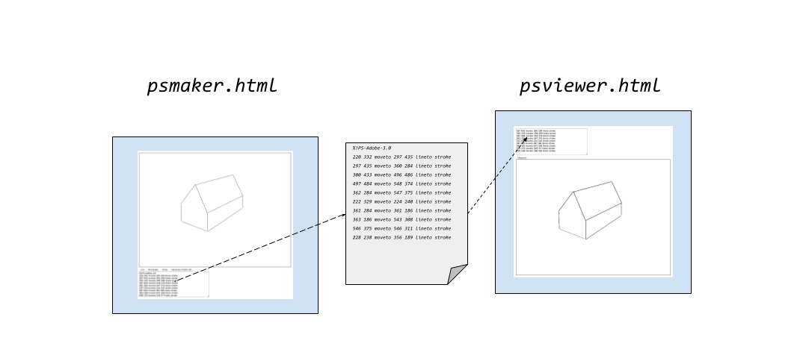

# Virtual Machines

[PostScript](POSTSCRIPT.md) is a versatile, widely-used page
description language and __programming language__ specifically
designed for creating graphics but also fancy "typographical"
(or typeset) text. As it is a programmming language, it is also
Turing complete. It operates *as a* virtual machine, which allows
for device-independent graphics rendering, meaning it can produce
*consistent results across different printers and displays*.
Although finding general-purpose graphics APIs in languages like
Python or C can be challenging and uncommon[^h], JavaScript’s
Canvas API stands out as a robust and accessible platform for
rendering vector graphics. This makes it an excellent choice for
those seeking functionality similar to PostScript. Therefore,
implementing a simple PostScript interpreter in JavaScript using
the Canvas API is both practical and straightforward.[^rip]

[^h]: This is especially relevant for our goal of being as
universally applicable as possible, selecting programming
languages that require minimal installations, additional
tools, or dependencies.

[^rip]: As most outputs are today based on dots or pixels,
somewhere the vectors have to be translated. In a laser printer
this is traditionally done through a RIP, a raster image processor
(https://en.wikipedia.org/wiki/Raster_image_processor).
Finding out how to draw a line, it calculates where to draw the
dot next looping through all the possible dots of the vector line.
A vector graphics display or a graphics plotter would on the other
hand, would probably be an easier conversion.



### psmaker

Your web browser may almost certainly support viewing local HTML
pages. Open the `psmaker.html` with a browser and draw something,
choosing between lines, rectangles and circles -- to make things
easy. Nothing fancy here, to keep to simple code and clear aim.

Generate PostScript with the click of the button. Copy the result
and ..

### psviewer

.. open the web browser with the HTML page `psviewer.html`, then
paste the result in the textbox. The result should look like the
drawing you made in `psmaker.html`.


### the vm in psviewer

The `interpretPostScript` function in `psviewer.html` parses and
interprets a simplified PostScript-like script to draw on an HTML
canvas. The function reads commands from the script, manipulates
a stack for operand storage, and issues drawing commands to the
canvas context (`ctx`).


#### Stack

```javascript
   const stack = [];
```
A stack is used to store operands (numbers) for PostScript commands.

#### Commands

```javascript
   const commands = script.split('\n').flatMap(line => line.trim().split(/\s+/));
```
The input script is split into lines, and each line is further
split into commands and operands, creating an array of tokens.

#### Interpretation

```javascript
   commands.forEach(command => {
       if (!isNaN(command)) {
           stack.push(parseFloat(command)); // push number
       } else {
           switch (command) {
               ..
           }
       }
   });
```

Each token is processed in turn:
- If the token is a number, it is pushed onto the stack.
- If the token is a command, it is interpreted through
a `switch` statement.

#### newpath

```javascript
  case 'newpath':
      ctx.beginPath(); // new path
      break;
```
Starts a new path on the canvas.

#### moveto

```javascript
  case 'moveto':
      const yMove = stack.pop();
      const xMove = stack.pop();
      ctx.moveTo(xMove, yMove); // move to new point
      break;
```
Moves the drawing cursor to a new point without
drawing a line. The coordinates are popped from
the stack.

#### lineto

```javascript
  case 'lineto':
      const yLine = stack.pop();
      const xLine = stack.pop();
      ctx.lineTo(xLine, yLine); // draw line to new point
      break;
```
Draws a line from the current position to a new
point, with coordinates taken from the stack.

#### arc

```javascript
  case 'arc':
      const endAngle = stack.pop() * (Math.PI / 180); // to radians
      const startAngle = stack.pop() * (Math.PI / 180); // to radians
      const radi = stack.pop();
      const yArc = stack.pop();
      const xArc = stack.pop();
      ctx.arc(xArc, yArc, radi, startAngle, endAngle); // draw arc
      break;
```
Draws an arc with the given center, radius, and
angles (converted from degrees to radians).

#### closepath

```javascript
  case 'closepath':
      ctx.closePath(); // close current path
      break;
```
Closes the current path by drawing a straight line
back to the starting point.

#### gsave / grestore

```javascript
  case 'gsave':
      graphicsStateStack.push({
          lineWidth: ctx.lineWidth,
          fillStyle: ctx.fillStyle,
          strokeStyle: ctx.strokeStyle
      });
      break;
  case 'grestore':
      if (graphicsStateStack.length > 0) {
          const state = graphicsStateStack.pop();
          ctx.lineWidth = state.lineWidth;
          ctx.fillStyle = state.fillStyle;
          ctx.strokeStyle = state.strokeStyle;
      }
      break;
```
`gsave` saves the current graphics state onto
a stack, while `grestore` restores the most
recently saved state.

#### setlinewidth

```javascript
  case 'setlinewidth':
      const linewidth = stack.pop();
      ctx.lineWidth = linewidth; // set line width
      break;
```
Sets the line width for subsequent drawing commands.

#### setgray

```javascript
  case 'setgray':
      const grayValue = stack.pop();
      ctx.fillStyle = `rgba(${grayValue * 255}, ${grayValue * 255}, ${grayValue * 255}, 1)`;
      ctx.strokeStyle = ctx.fillStyle; // set stroke color to same gray
      break;
```
Sets the fill and stroke color to a shade of gray
based on the given value (0 to 1).

#### fill / stroke

```javascript
  case 'fill':
      ctx.fill(); // fill current path
      break;
  case 'stroke':
      ctx.stroke(); // render path
      break;
```
`fill` fills the current path with the current
fill color, while `stroke` renders the path
outline with the current stroke color.

#### showpage

```javascript
  case 'showpage':
      // no-op for this impl.
      break;
```
A no-op in this implementation, typically used
to finalize and display the page in PostScript.
It is also dropped in ESP[^eps] when more documents
are glued together, as it renders which makes
the rest of the document (if there is) obsolete
as the rest is not rendered.

[^eps]: https://en.wikipedia.org/wiki/Encapsulated_PostScript

### integration with HTML

The function `interpret` is designed to be
triggered by a button to process the input
PostScript code from a textarea:

```javascript
function interpret() {
    const postScript = document.getElementById('input').value;
    interpretPostScript(postScript);
}
```
This function reads the PostScript code from
a textarea elemen with id `input`, and then
calls `interpretPostScript` to render it on
the canvas.

### changing the coordinate system

As PostScript has a different coordintate system
than Canvas, some convertions has to be made.
The initial coordinate system for PostScript has
the x axis to the right and y axis upwards, the
origin is located at the bottom left hand corner
of the page. Canvas on the other hand, has the
upper-left corner of the screen as origin, so x
and y goes instead downwards increasing their
values.

So one way to handle this is to do what can be
seen in `psmaker.html` where each point gets
transformed easily through an 'arithmetical
geometry' process, while in `psviewer.html`
the whole canvas is transformed before drawing
through rather standard rotations and flipping
through 2D matrices. They may have different
results partly due to such things as precision
in numbers when calculating.

## postscript: the language

> The three most important aspects of the PostScript programming
> language are that it is *interpreted*, that it is *stack-based*,
> and that it uses a unique data structure called a *dictionary*.[^design]

[^design]: Reid, Glenn C., *PostScript language program design*,
Addison-Wesley, Reading, Mass., 1988, p.2.

PostScript’s interpreted nature parallels the concept of virtual
machines introduced in computing, where execution doesn’t rely on
binary or bytecode representations. Instead it directly interprets
*source code*. In PostScript, the source code serves a role akin
to our familiar *bytecodes* in other contexts.

PostScript employs multiple *stacks*—general, graphics, dictionary,
etc.—alongside a dictionary reminiscent of *procedures* (or like *def*
in Pyhton etc., a way to name and abstracts some routine that can be called)
seen in other languages. This setup allows named entities to be invoked and yield
results.

When PostScript source code is transported and interpreted, or along
the line rasterized, it’s notable that the program’s text isn’t manually
crafted by a programmer. Instead, it’s typically *generated* by software
like PageMaker. Indeed, while programmers can write in PostScript, it's
not typically practical to manually create complex documents such as
book layouts directly in PostScript unless the goal is to build a rasterizer,
debugger, driver, or similar tool. For creating professional layouts
efficiently, designers would use specialized software like InDesign,
QuarkXPress, PageMaker, Illustrator, or similar tools tailored for graphic
design and publishing. These applications provide user-friendly interfaces
and powerful features that streamline the layout and design process,
offering more efficient workflows compared to manually coding in PostScript.

### samples

As there are over 250 commands (instructions) in PostScript,
there are a lot to go through, but as this is not a reference
manual,[^sref] we will though take some illustrative and simple examples.

[^sref]: A small reference: https://personal.math.ubc.ca/~cass/courses/ps.html
A reference to level 2: https://www.os2site.com/sw/dev/openwatcom/docs/postscript_level_2_reference_manual.pdf
or an introduction to PS: http://www.tailrecursive.org/postscript/postscript.html
A lot of resources from Don Lancaster: https://www.tinaja.com/pssamp1.shtml

You might recognize how numbers are added or substracted for
instance, leaving its result on the stack.

```postscript
40 67 add
90 543 sub
```

To swap the two top numbers on the stack, instead of `swap` we
used previously, it is here called `exch` for 'exchange'.

```postscript
23 90 exch
````

The stack would be '90 23' after the operation. But mostly
it is naturally for graphics. Test the following with
`psviewer.html`.

```postscript
%!PS
newpath
100 200 moveto
200 450 lineto
stroke
showpage
```

Draws a from left to right a steep line. It starts from where
the point of deeparture is set with `moveto` which uses the
two top numbers from the stack. Next two other numbers are put
on the stack and the line is drawn starting from  `moveto` to
where it ends with `lineto`. The line itself is determined by
`stroke` (there can be other commands here).

```postscript
%!PS
newpath
100 200 moveto
200 450 lineto
100 400 lineto
closepath
3 setlinewidth
0.5 setgray
stroke
showpage
```

This draws a triangle but with a slightly gray stroke which have
a thickness of 3. It also ends all the 'legs' by connecting the
with the start from the `moveto` of `newpath` by ending in 
`closepath`. In SVG the 'z' at the end of a path works the same
way, as the command draws a straight line from the current
position back to the first point of the path.

## psviewer2

A small upgrade is `psviewer2.html` with the accompanying
`psviewer2.js`. The essential difference is inclusion of the
user defined dictionaries. It take two pass on the input, the
first stacks the user defined commands, and the second pass
executes on the script. It is not fully tested, but illustrates
the included samples `sample2a.ps` and `sample2b.ps`.[^ps2]

[^ps2]: The samples are from:
https://paulbourke.net/dataformats/postscript/

When defining a new addition to the dictionary:

```postscript
/name {
    body
} def
```

where *name* is the name of the addition and *body* has the
commands that can be executed when invoking the name in the
script. Definitions are collected in `collectDefinitions`
that parses the input script to identify and store named
definitions. In the next pass `executeScript` executes the
input script by processing each command and updating the
stack accordingly.

The latter pass have `interpretDefined` which interprets
and executes defined PostScript commands, and
`executeGraphicsCommand` which handles various PostScript
graphics commands like newpath, moveto, lineto, arc, etc.
with some additions to the previous `psviewer.html` above.
The `saveGraphicsState` and `restoreGraphicsState` are
just separated commands saving and restoring the graphics
state to/from the graphics state stack.


#### sample2a.ps

To draw something slightly more interesting, a script that
can show colors.

```postscript
%!PS
newpath
100 100 moveto
0 100 rlineto
100 0 rlineto
0 -100 rlineto
-100 0 rlineto
closepath
gsave
0.5 1 0.5 setrgbcolor
fill
grestore
1 0 0 setrgbcolor
4 setlinewidth
stroke
showpage
```

The script draws a filled light green square with a thick
red border on a PostScript page. The square is 100x100 units,
with its bottom-left corner at (100, 100). The fill color is
set to light green (0.5, 1, 0.5), and the stroke (outline)
color is set to red with a line width of 4 units. The `gsave`
and `grestore` commands are used to isolate the fill color
change so it does not affect the stroke color. Experiment
with changing parts in the script.


#### sample2b.ps

Another script uses the definition in the dictionary.

```postscript
/csquare {
  newpath
  0 0 moveto
  0 1 rlineto
  1 0 rlineto
  0 -1 rlineto
  closepath
  setrgbcolor
  fill
} def
```

This section defines a dictionary entry (procedure) called 'csquare'.
When called, it:
- initializes a new path with `newpath`,
- moves to the origin (0, 0) using `moveto`,
- draws (relative) lines to form a square of size 1x1 unit:
    - 0 1 `rlineto` draws a line from the current point to (0, 1),
    - 1 0 `rlineto` draws a line from the current point to (1, 1),
    - 0 -1 `rlineto` draws a line from the current point to (1, 0),
- closes the path with `closepath`, creating a square,
- sets the RGB color using `setrgbcolor`, and
- fills the square with the current color using `fill`.

The rest of the script:

```postscript
20 20 scale
5 5 translate
1 0 0 csquare
1 0 translate
0 1 0 csquare
1 0 translate
0 0 1 csquare
showpage
```

This first line scales the coordinate system
by 20 in both x and y directions. This means
that subsequent drawing operations are magnified
by a factor of 20.

Second line translates (moves) the origin
of the coordinate system to the point (5, 5)
in the *new scaled coordinates*.

Then some lines are alomst the same, some
numbers are pushed as 1 0 0 *uses* the 'csquare'
drawing a red sqare with the colors from the
stack,  in this case red for 1, green and blue
are 0. And so on.


### logging

Next, we will explore tools designed for traditional
programming tasks. These tools are versatile but also
support the various virtual machine environments we
use. A particularly valuable tool for both debugging
(identifying and fixing code issues) and tracking the
history of executed commands is *logging*.

Logging provides a way to record events, errors, and
other significant occurrences within a system. System
logs, for instance, are an essential feature of
conventional operating systems. They detail what the
system is doing, when it’s doing it, and how it’s being
done. This information is crucial for diagnosing issues
such as performance bottlenecks or problems with the
execution of system components. By analyzing these logs,
developers and system administrators can gain insights
into the system’s behavior and identify areas that
need improvement or repair.
