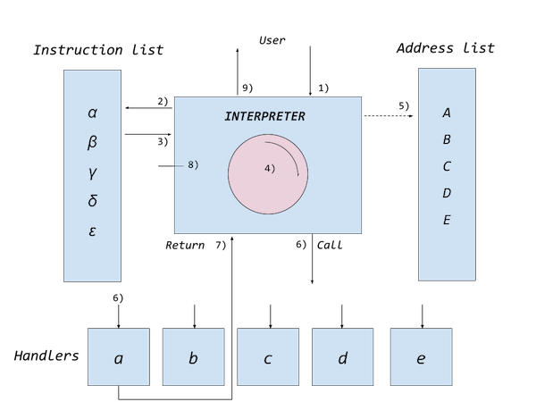

# Virtual Machines

*A very simple virtual machine implemented as a stack machine.[^stackmachine]
(See also [REGVM.md](REGVM.md).)*

> As an example: Push two numbers on the stack. Each at a time.
Then add the two numbers. Place the result back on the stack. Take
the value of the top of stack. Then print this sum. Halt.

[^stackmachine]: See e.g. https://www.cp.eng.chula.ac.th/~prabhas//teaching/ca/stack.htm
or (at present not very well organized) https://en.wikipedia.org/wiki/Stack_machine.
There are other ways of building virtual machines, one such
is the register machine. Instead of a stack it relies in
main on registers: https://en.wikipedia.org/wiki/Register_machine.
In the following we will not focus further on register machines,
but keep to stack machines for simplicity.

It might look odd with first pushing two numbers on stack then
have an operation on them after. Instead of "5 + 9" most of us
use daily, we could have written this expression as "+ 5 9".
Here the add sign is taken before the operands. This is actually
very ingenious.[^polish] We could get rid of parentheses, as the
notation easily allows for priorities of operations, without a
previous convention for priorities. In this case we however
reverse the notation such that the operand comes last "5 9 +".
This is called RPN.

[^polish]: See https://plato.stanford.edu/entries/lukasiewicz/polish-notation.html.
This is actually a reference to the origin in logic, esp. propositional
logic. But from a formal standpoint it works equally well with simple
aritmetical expressions with '+', '-', '*' and '/' instead of
logical connectives as e.g. '&', '.', '->' or as with Łukasiewicz
'C', 'K', 'A' etc.

You might already be familiar with RPN or "reverse polish notation"
which has been used by Hewlett Packard with their calculators.
Or you might have experience with some programming language
(e.g. FORTH) which uses this notation.


## stack

The stack works as a 'LIFO' memory: 'last in first out'.
We begin with a stack of numbers, starting with 1 at the bottom and stacked
right over is number 2. Then we put 5 at the stack, now it is on top.
Another number 9 is stacked on top of number 5. To use the stack we start
from the top and work ourselves down. Adding two numbers, we take first 9
and then 5, and make the addition. The answer 14 we stack on top again,
ready for further steps.


This works as you can see very well with RPN. As computers often
are built on simple foundational operations like addition, and
these can be used through the stack, stack machines can often be a
useful concept.


## vm1

A representation of a sample program is hard coded into `vm1.c`:

```c
int program[] = {
  SET, 33,
  SET, 44,
  ADD,
  PRINT,
  HALT
};
```

```assembly
  SET, 33,        <- store 33 on the stack, 33 on the top
  SET, 44,        <- next, store 44 on the stack, top now 44
  ADD,            <- add the two numbers on the stack, 33 + 44 = 77, and put the result on stack
  PRINT,          <- take what is on the stack and print (77)
  HALT            <- halt the program
```

Everything in the program is represented as integers (positive integers).
For instance `SET` is internally represented by a number (5), `ADD` is
represented by another number (2), and so on. A switch statement selects
each "instruction" and executes the corresponding routine.

```c
...
case SET:
  v = nextcode(vm);
  push(vm, v);
  break;
...
```

The instruction for storing numbers on the stack is `SET`. When executed,
the next instruction in line (a number), will be put on stack `push(vm, v)`
where *vm* represents the main structure for the virtual machine (program
counter, stack pointer ...) and *v* is the value to be put on the stack.

In `vm1.c` the important functions are:
- `VM* newVM(int* code, int pc)` which allocates vm, struct for the stack, code array, program counter (pc) and stack pointer (sp).
- `void freeVM(VM* vm)` deallocates vm.
- `int pop(VM* vm)` moves the pointer (sp) at the array for the stack to pop a value, stack impl. here as a fixed array.
- `void push(VM* vm, int v)` push a value on stack.
- `int nextcode(VM* vm)` move the pointer (pc) at the array to the next code in line. Can be value or operation depending on previous code.
- `run(VM* vm)` the "processor". Picks a code from the array, and finds out what the operation will do, and execute on it.

## run

Compile with gcc installed, and then run:

```sh
> gcc vm1.c
> ./a.out
```

Or, if not gcc installed:

```sh
> cc vm1.c -o vm1
> ./vm1
```

You should be able to see what 33 + 44 is ... (hint 77).

## interpreter technique

Close to "virtual machines" there is in principal an "interpreter technique".
The main point of the technique can be described as:[^interpret]

[^interpret]: In main translated excerpt from the Swedish journal *Modern elektronik*,
no. 8, 1981. Ideas and facts by Hans Beckman, Johan Finnved, ed. Gunnar Christernin.
In this exact part they mention examples of floating point calculation, and that
compilers should be able to use this technique.

1. the interpreter is called, with a list of instructions as argument
2. the interpreter takes an instruction from the incoming list,
3. do a look up in the internal list of instructions (types),
4. then the interpreter ”interprets” the instruction of what to do,
5. which points to an address list, and thus a corresponding handler for each (type of) instruction,
6. the handler is called, do something,
7. after handling, the call returns from the handler, and
8. the interpreter goes on to the next instruction, start over from 1 to 8 as long as there are instructions left
9. when all the instructions have been consumed, the interpreter returns to the main caller



In the application here, the core of the interpreter in the vm is in principle
in some kind of pseudo code, which have similarities to C:

```c
A: { `handler a` return }
B: { `handler b` return }
...

do {
  opcode = `next instruction`
  switch (opcode) {
    case α:
      call A:
      break;
    case β:
      call B:
      break;

      ...
  }
} while (TRUE);
```

## portability

One of the many praised features of virtual machines is enabling *portability of
code*. You can try another version of the virtual machine in:

1. *alternate-vm.html*, which you can run in your browser. Copy to the desktop
and double-click, check through the developer option in your browser the output
from "console.log".
2. Another stripped and rudimentary implementation is in *alternate-vm.py*, which
you can run if Python >3.10 is installed.
3. Or use *alternate-vm.php* in PHP.

You will notice the program is the same in *principle* (as the opcodes can also
be) so we only implement a new virtual machine each time we would like to run the
program on another system, operating system, hardware, etc. *The code for the
program then can remain the same.* Sun Microsystems Inc., the company originally
behind the programming language Java, once had a slogan: "Write Once, Run Anywhere,"[^any]
that kind of illustrates that idea.

[^any]: See https://en.wikipedia.org/wiki/Write_once,_run_anywhere
