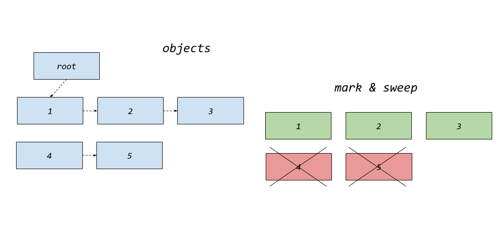

# Virtual Machines

## garbage collection

To this point, we've deliberately avoided discussing the
specifics of *memory* and *memory management* for the virtual
machine (VM). While we've acknowledged that the *stack*
represents a form of memory allocation, we've kept it tightly
integrated with the stack machine's operations. As such, the
stack should be constrained to a predetermined size to prevent
excessive memory usage or potential overflow. This approach
ensures that memory allocation and deallocation related to
function calls, intermediate calculations, and other stack
operations remain manageable and bounded within these constraints.

However, if we introduce a language model to the VM with
a more flexible hold on data structures, memory management
can become more complex, particularly concerning the handling
of more dynamic data structures within the language.
The memory model in this context may benefit
from abstracting away manual memory management concerns,
allowing the language to handle allocation and deallocation
automatically.

One of the primary challenges here lies with the *heap*,
a memory region used for dynamic allocation. Unlike the stack,
the size and lifetime of objects on the heap cannot typically be
determined at compile time. As a result, managing heap memory
efficiently is crucial, as improper handling can lead to memory
leaks.

For instance, in Python, memory management is largely abstracted
away from the developer, thanks to the built-in garbage collector[^gc].
This system automatically tracks and reclaims memory, alleviating
the need for explicit memory management. In contrast, languages
like C require the developer to manually manage memory, including
determining how much memory to allocate and ensuring that it's
properly freed when no longer needed. A common but suboptimal
approach in C is to allocate a large block of memory at the start
of the program and allow the application to crash if this memory
is exhausted -- like we have done previously.

This method, while simple, is far from ideal in a real-world scenario.
A more sophisticated approach in C might involve implementing a form
of garbage collection, where memory is periodically reclaimed at
appropriate points in the program's execution. This can help prevent
memory leaks and ensure that memory is used efficiently, although
it requires careful design and consideration of when and how to
trigger the garbage collection process.

[^gc]: https://en.wikipedia.org/wiki/Garbage_collection_(computer_science)

In C, functions like `malloc` (memory allocation) and `free`
(deallocation) are used to manage memory on the heap. When you
allocate memory using `malloc`, a block of memory is reserved
on the heap, and you receive a pointer to that memory. When
you are done using that memory, you must manually release
it using `free` to avoid memory leaks.
Over time, as memory is allocated and deallocated, the heap can
become very *fragmented*, which can lead to inefficient use of
memory and, in some cases, allocation failures if there
isn’t a large enough contiguous block available.

Memory management in a VM can involve several critical aspects.
They can including allocation, deallocation, and garbage collection.
For C this poses additional challenges, as C
does not automatically reclaim unused memory, leading to
potential memory leaks and crashes if not managed correctly.

A sample of a very simple illustration of this can be seen in
`gc.c`. The provided code snippet demonstrates a basic implementation
of a mark-and-sweep garbage collector. It manages a heap of
`Object` instances, performs garbage collection when necessary,
and provides utility functions to create and list objects.


### memory management considerations in C

*Static vs. dynamic allocation*
   - *Static*. Memory is allocated at compile-time. While this
   is straightforward, it limits flexibility and can waste memory
   if the allocation size is not well-calibrated.
   - *Dynamic*. Memory is allocated at runtime using functions
   like `malloc` and `free`. This is more flexible but requires
   careful management to avoid leaks and fragmentation.

*Constraints and safety*
   - *Pre-allocated heap*. Allocating a fixed-size heap and crashing
   when it is full, as in the previously provided example, is simple
   but not ideal. It does not handle scenarios where memory demands
   fluctuate or where memory can be reclaimed dynamically.
   - *Garbage Collection (GC)*. Implementing garbage collection helps
   automatically manage memory by reclaiming unused objects, but it
   introduces overhead and some complexity.


### gc.c

Compile and run:

```shell
> make gc
> ./gc
```

The internals:

   ```c
   typedef struct Object {
       int marked;  // mark flag
       struct Object* next;  // a simple linked list ..
   } Object;
   ```
   - `marked`: A flag used during garbage collection to
     indicate if the object is reachable.
   - `next`: A pointer to the next object in a linked list
     (which simulates an object reference).


   ```c
   Object* heap[MAX_OBJECTS];
   int num_objects = 0;
   ```
   - `heap`: An array of pointers to `Object` structures,
      representing the managed heap.
   - `num_objects`: The count of objects currently in the heap.


   ```c
   Object* root = NULL;
   ```
   - A pointer to an `Object` that serves as the point for
   the garbage collection process. Objects reachable from
   `root` are considered *live* (in use).


#### GC functions

Allocates a `new_object` and triggers garbage collection,
if the heap is full:

   ```c
   Object* new_object() {
       if (num_objects >= MAX_OBJECTS) {
           printf("Heap full, running garbage collection...\n");
           mark_and_sweep();
           if (num_objects >= MAX_OBJECTS) {
               printf("Out of memory!\n");
               exit(1);
           }
       }
       Object* obj = (Object*)malloc(sizeof(Object));
       obj->marked = 0;
       obj->next = NULL;
       heap[num_objects++] = obj;
       return obj;
   }
   ```

Recursively marks with `make` all reachable objects,
starting from the given `obj`:

   ```c
   void mark(Object* obj) {
       if (obj == NULL || obj->marked) return;
       obj->marked = 1;
       printf("Marking object at %p\n", (void*)obj);
       if (obj->next) {
           mark(obj->next);
       }
   }
   ```

It `sweep`and thus frees objects that are not marked
as reachable and reorganizes the heap:

   ```c
   void sweep() {
       for (int i = 0; i < num_objects; i++) {
           if (heap[i]->marked) {
               heap[i]->marked = 0;
           } else {
               printf("Sweeping object at %p\n", (void*)heap[i]);
               free(heap[i]);
               heap[i] = heap[--num_objects];
               i--; // adjust index as object get lost
           }
       }
   }
   ```

Main GC, `mark_and_sweep`:

   ```c
   void mark_and_sweep() {
       mark_all();
       sweep();
   }
   ```



In the picture, a root object in blue keeps three linked
objects: 1, 2 and 3. There are two objects that
are not linked to the root, 4 and 5 in blue (orphans).
The garbage collector marks the three objects 1,2 and 3
as "alive" in green, but decides that 4 and 5 are "not"
alive in red, thus mark them for garbage collection,
which translates to a cross here.


### examples of usage

In a VM context, the provided garbage collection
implementation can be adapted to manage various
types of objects.

*Objects in a programming language*
   - *Data structures*: The `Object` structure could represent objects
   like *strings*, *arrays*, or *user-defined types* (in a VM).
   - *Memory management*: The GC can automatically reclaim memory for
   objects that are no longer reachable, reducing the risk of memory leaks.

*VM internals*
   - *Stack frames*: Objects could represent stack frames or other
   internal data structures.
   - *Instruction state*: The linked list could represent a sequence
   of instructions or state information that needs to be managed.


### gc2.c

```shell
> make gc2
> ./gc2
```

The `gc2.c`have some slight improvements over `gc.c`.

But a better garbage collector can have improvements 
in object management through the *reference counting*,
and deeper *pools*[^pool]. Besides addition to mark-and-sweep,
implementing reference counting can help manage objects
(with circular references) more effectively. For frequently
allocated and deallocated objects of the same size,
using memory pools can reduce fragmentation and improve
performance. To my experience, manunal reference counting[^rc]
in Objective-C for iOS was hard to keep track of. Though
the later automatic version[^arc] should have made this better.

[^pool]: https://en.wikipedia.org/wiki/Region-based_memory_management

[^rc]: https://en.wikipedia.org/wiki/Reference_counting
[^arc]: https://en.wikipedia.org/wiki/Automatic_Reference_Counting


### pros and cons

An obvious and often lengthy discussion is about the benefits
and problems of garbage colletion versus manual memory handling,
which have consequences when designing virtual machines.

On the plus side GC simplifies the development by automatically
reclaiming memory that is no longer in use, reducing risk of memory
leaks, errors related to manual memory management, and focus
can go to the main task of the program itself instead.

The cons are runtime overhead, as it somewhere and sometimes
has to check for potential garbage collections. Developers have less
control over when and how memory is freed. Garbage collectors
themselves may require additional memory overhead.

So, in the case of manual control the developers have full
control over memory allocation and deallocation. Manual management
can lead to lower runtime overhead and more predictable performance
of the program. Without the overhead, applications may even
have a smaller memory footprint.

However manual memory management is error-prone and can lead to
the above issues of memory leaks, buffer overflows, and other
vulnerabilities. Developers must carefully track and manage memory usage,
which can increase development time and complexity. Mistakes can lead
to hard-to-debug issues, crashes, undefined behavior, etc.


## vm5.c

A very limited VM shows us the functionality of adding
a new data structure, using the GC.

   ```c
   int program[] = {
       ADD_NUM, 10,    // add number 10 to list
       ADD_NUM, 20,    // add number 20 to list
       ADD_NUM, 30,    // add number 30 to list
       ADD_NUM, 40,    // add number 40 to list
       ADD_NUM, 50,    // add number 50 to list
       PRINT_LIST,     // print list: 10 20 30 40 50
       ADD_NUM, 60,    // add 60 to list
       PRINT_LIST,     // print list: 10 20 30 40 50 60
       DELETE_NUM, 0,  // delete first element (index 0), which is 10
       ADD_NUM, 70,    // add number 70 to list (should fit?)
       PRINT_LIST,     // print list: 20 30 40 50 70
       HALT            // stop
   };
   ```

### explanation

The first five instructions (`ADD_NUM, 10`, `ADD_NUM, 20`, etc.)
add numbers 10, 20, 30, 40, and 50 to the list sequentially.
As each number is added to the lisst, the `new_object` function
is called to allocate memory for each new object.
But if the heap becomes full, the `mark_and_sweep` function
triggers garbage collection to free up space. Seems like a good
place to do this.

After adding five numbers, the `PRINT_LIST` is executed.
This prints current list: `10 20 30 40 50`.

When trying to add the sixth number (60), the `new_object` function
checks if the heap is full. Since the heap is already at capacity of 5,
the `new_object` triggers garbage collection through `mark_and_sweep`.
If garbage collection is not enough to free up sufficient space, the
heap is extended using `extend_heap`, which increases the heap capacity
of another 5 elements and reallocates sufficient memory.

After garbage collection and potential heap extension, the number 60
is added to the list. The `PRINT_LIST` is executed again,
showing updated list of: `10 20 30 40 50 60`.

The `DELETE_NUM, 0` instruction deletes the element at index 0.
This means removing the first element (10) from the list,
adjusting the links in the list to bypass the removed element,
and freeing the memory of the deleted object thus removing it
from the heap list. After deletion, the heap may have space freed.
But a garbage collection pass is executed after this to ensure
that any newly freed memory is properly reclaimed.

The number 70 is added to the list after deletion. Since space has
been freed by deleting an element, this addition should succeed
without triggering additional heap extension at this point, and
could thus in principle be reclaimed.

At last `PRINT_LIST` shows final contents, and
`HALT` stops the VM execution.
